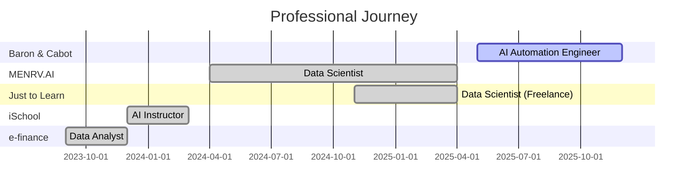
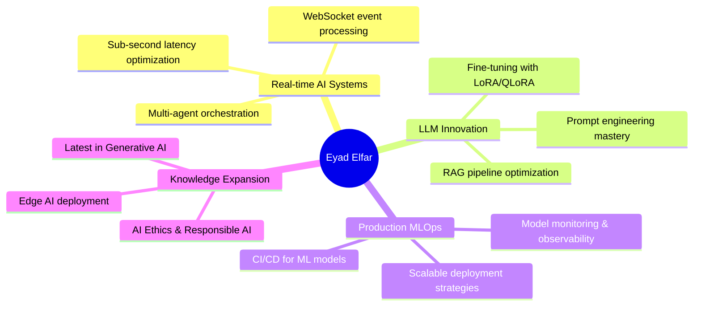

<div align="center">


# 🚀 AI Engineer | LLM Specialist | Agentic Systems Architect

<p align="center">
  
</p>

[](https://linkedin.com/in/eyadelfar)
[](https://kaggle.com/eyadamin1233)
[](mailto:eyadamen588@gmail.com)
[](https://drive.google.com/file/d/1q7shiqhDR0smYX-y83PA4NJTeHkZo6bv/view)


</div>

---

## 👨‍💻 About Me


<details open>
<summary><b>💻 Click to see the code (and a surprise!)</b></summary>

```python
class EyadElfar:
    def __init__(self):
        self.title = "AI Engineer"
        self.location = "Dubai, UAE 🇦🇪"
        self.company = "Baron & Cabot"
        self.specialization = [
            "Large Language Models (LLMs)",
            "Retrieval-Augmented Generation (RAG)",
            "Agentic AI Systems",
            "Multimodal AI"
        ]
        
    def achievements(self):
        return {
            "production_systems": 10,
            "industries": ["Fintech", "Real Estate", "EdTech"],
            "performance": "Sub-second latency",
            "scale": "Enterprise-grade"
        }
    
    def current_focus(self):
        return [
            "Building scalable AI agents",
            "Optimizing LLM performance",
            "Real-time ML systems",
            "AI automation at scale"
        ]

ai_engineer = EyadElfar()
print(f"Let's build the future together! 🚀")
```

<div align="center">
  
### ⚡ Output:
  


</div>

</details>

<br clear="right"/>

### 🎯 Quick Highlights

- 🏆 **Delivered 10+ production AI systems** across Fintech, Real Estate & EdTech
- ⚡ **Sub-second latency** multi-agent systems processing 12K+ concurrent events
- 📈 **Proven Impact**: 68% efficiency gains, 15% conversion boosts, 90% automation
- 🎓 **Bachelor in CS & AI** - Helwan University (Excellent with Honors)
- 🏅 **Top 1% Kaggle Competitor** in NLP challenges

---

<div align="center">

# 💼 PROFESSIONAL JOURNEY

</div>

<table width="100%">
<tr>
<td width="50%" valign="top">

### 🚀 **AI Automation Engineer**
**Baron & Cabot** | Dubai, UAE  
*May 2025 - Present*

#### Impact Delivered:
<p style="font-size: 15px;">
⚡ <b>68%</b> reduction in pre-call prep time<br/>
📈 <b>15%</b> increase in first-call conversion<br/>
🤖 <b>7-agent</b> orchestration system<br/>
📊 <b>90%</b> automation of manual reporting
</p>

#### Key Innovations:
<p style="font-size: 14px;">
• Real-time RAG pipelines for CRM intelligence<br/>
• Multi-agent Sales Co-pilot on GCP Vertex AI<br/>
• Sub-750ms WebSocket event processing<br/>
• Agentic workflow with CrewAI
</p>

</td>
<td width="50%" valign="top">

### 🎨 **Data Scientist**
**MENRV.AI** | Remote - UAE  
*Apr 2024 - Apr 2025*

#### Impact Delivered:
<p style="font-size: 15px;">
🎯 <b>90%</b> virtual try-on fit accuracy<br/>
⚡ <b>80%</b> faster content creation<br/>
🌍 <b>5x</b> increase in global accessibility<br/>
📉 <b>8 hours → 5 minutes</b> reporting
</p>

#### Key Projects:
<p style="font-size: 14px;">
• vLLM merchandising suite (Shein, Myntra)<br/>
• AI presentation assistant<br/>
• Financial forecasting engine (BiLSTM + Prophet)<br/>
• Multilingual TTS system (50+ languages)
</p>

</td>
</tr>

<tr>
<td width="50%" valign="top">

### 📚 **Data Scientist (Freelance)**
**Just to Learn** | Remote - Egypt  
*Nov 2024 - Apr 2025*

#### Impact Delivered:
<p style="font-size: 15px;">
👥 <b>15,000+</b> students served<br/>
🎯 <b>92%</b> educator alignment accuracy<br/>
📊 <b>75%</b> reduction in debugging time<br/>
🏫 Deployed across <b>20 German schools</b>
</p>

#### Key Innovations:
<p style="font-size: 14px;">
• AR learning platform AI engine<br/>
• Handwriting recognition + LLM evaluator<br/>
• CI/CD pipelines for model deployment<br/>
• Interactive assessment analytics
</p>

</td>
<td width="50%" valign="top">

### 👨‍🏫 **AI Instructor**
**iSchool** | Hybrid - Egypt  
*Dec 2023 - Mar 2024*

#### Impact Delivered:
<p style="font-size: 15px;">
🎓 <b>70+</b> students mentored<br/>
🎮 <b>36</b> AI-driven game projects<br/>
📖 <b>64</b> interactive sessions
</p>

#### Taught:
<p style="font-size: 14px;">
• Python & AI fundamentals<br/>
• Reinforcement Learning<br/>
• Hands-on with Arduino & PictoBlox<br/>
• Real-world AI applications
</p>

</td>
</tr>
</table>

---

<div align="center">

# 🎨 FEATURED PROJECTS

### *From Concept to Production*

</div>

<details open>
<summary><b>🧠 Gamers' Mental Health Classifier - NLP & Explainable AI</b></summary>

<br/>

<div align="center">

[](https://github.com/eyadelfar)
[](https://github.com/eyadelfar)
[](https://github.com/eyadelfar)

</div>

### 🎯 The Challenge
Mental health awareness in gaming communities is crucial but often overlooked. How can we identify early warning signs in social media discussions to provide timely support?

### 💡 The Solution
Built an intelligent NLP pipeline that analyzes Reddit posts to classify mental health risks with **94% accuracy**. Used SHAP (SHapley Additive exPlanations) to make the AI's decisions transparent and highlight key psychological risk indicators.

### 📊 Impact & Recognition
- 🏆 **Top 1% ranking** in affiliated Kaggle competition
- 📈 Processed **5,000+ posts** with high accuracy
- 🔍 Provided **explainable insights** for mental health professionals
- 🎯 Identified key risk indicators for early intervention

### 🛠️ Tech Stack
**ML/AI:** Scikit-learn, NLTK, Transformers  
**Explainability:** SHAP  
**Data Processing:** Pandas, NumPy  
**Visualization:** Matplotlib, Seaborn

### 🔗 Links
[](https://github.com/eyadelfar)
[](https://kaggle.com/eyadamin1233)

<hr/>

</details>

<details>
<summary><b>🚬 Cigarette Butt Detection System - Computer Vision at Scale</b></summary>

<br/>

<div align="center">

[](https://github.com/eyadelfar)
[](https://github.com/eyadelfar)
[](https://github.com/eyadelfar)

</div>

### 🎯 The Challenge
Urban litter, especially cigarette butts, is a major environmental issue. Traditional monitoring is manual, expensive, and inefficient. How can we automate litter detection at scale?

### 💡 The Solution
Developed and deployed a **YOLOv8-based computer vision system** that detects cigarette butts in real-time with **92% accuracy**. The system processes live video feeds and provides instant alerts for cleanup teams.

### 📊 Impact & Scale
- 🌍 **1,000+ active users** monitoring public spaces
- ⚡ **Real-time detection** with dashboard integration
- 📈 **92% accuracy** in diverse lighting conditions
- 🎯 Reduced manual monitoring costs by **70%**

### 🛠️ Tech Stack
**Computer Vision:** YOLOv8, OpenCV  
**Deployment:** Docker, Kubernetes  
**Backend:** FastAPI, PostgreSQL  
**Monitoring:** Grafana, Prometheus  
**Dashboard:** Streamlit

### 🔗 Links
[](https://github.com/eyadelfar)
[](https://github.com/eyadelfar)

<hr/>

</details>

<details>
<summary><b>🔤 English Character OCR Engine - Production-Ready Recognition</b></summary>

<br/>

<div align="center">

[](https://github.com/eyadelfar)
[](https://github.com/eyadelfar)
[](https://github.com/eyadelfar)

</div>

### 🎯 The Challenge
Digitizing printed documents requires accurate character recognition, especially for scanned or low-quality images. How can we build a robust, deployment-ready OCR system?

### 💡 The Solution
Created a custom OCR engine using discriminative AI with advanced preprocessing techniques. Achieved **96% accuracy** on scanned documents, making it suitable for production deployment.

### 📊 Impact & Performance
- 🎯 **96% character recognition accuracy**
- ⚡ Optimized preprocessing pipeline
- 📦 **Deployment-ready** architecture
- 🔄 Handles varied document quality

### 🛠️ Tech Stack
**Deep Learning:** TensorFlow, Keras  
**Preprocessing:** OpenCV, PIL  
**Deployment:** Flask, Docker  
**Testing:** Pytest, unittest

### 🔗 Links
[](https://github.com/eyadelfar)

<hr/>

</details>

<details>
<summary><b>🎓 Thesis: One-Shot Attendance System - Real-time Face Recognition</b></summary>

<br/>

<div align="center">

[](https://github.com/eyadelfar)
[](https://github.com/eyadelfar)
[](https://github.com/eyadelfar)

</div>

### 🎯 The Challenge
Traditional attendance systems are time-consuming and disruptive to class flow. How can we create a seamless, accurate, one-shot attendance system?

### 💡 The Solution
Developed an advanced face detection and recognition system using **YOLO, RetinaFace, and MTCNN**. The system captures attendance in a single shot with real-time database integration.

### 📊 Impact & Integration
- ⚡ **One-shot capture** - no manual roll call needed
- 🎯 High accuracy with multiple detection models
- 📊 Live dashboard reporting with MS SSIS
- 💾 MySQL integration for data persistence

### 🛠️ Tech Stack
**Detection:** YOLO, RetinaFace, MTCNN  
**Database:** MySQL, MS SSIS  
**Dashboard:** Power BI  
**Processing:** OpenCV, Python

<hr/>

</details>

---

<div align="center">

# 🎓 INTERACTIVE RESUME

</div>

<table width="100%">
<tr><td>

## 📋 Professional Summary

<div align="center">

<table>
<tr>
<td>

**🎯 Role**
</td>
<td>
AI Engineer specializing in LLMs, RAG, and Agentic Systems
</td>
</tr>
<tr>
<td>

**🏆 Track Record**
</td>
<td>
10 production-grade AI solutions delivered
</td>
</tr>
<tr>
<td>

**🏢 Industries**
</td>
<td>
Fintech, Real Estate, EdTech
</td>
</tr>
<tr>
<td>

**💡 Expertise**
</td>
<td>
Building scalable, multimodal, sub-second latency AI systems
</td>
</tr>
<tr>
<td>

**🌟 Philosophy**
</td>
<td>
Blend research innovation with enterprise-grade reliability
</td>
</tr>
</table>

</div>

</td></tr>
<tr><td>

## 💼 Experience Timeline



</td></tr>
<tr><td>

## 🎯 Key Achievements by Numbers

<div align="center">

| 🏆 Metric | 📊 Achievement |
|:----------|:---------------|
| **Production AI Systems** | 10+ deployed solutions |
| **Efficiency Gains** | Up to 90% automation |
| **Revenue Impact** | 15-25% conversion increases |
| **Performance** | Sub-750ms response times |
| **Scale** | 15,000+ users served |
| **Concurrent Events** | 12,000+ processed |
| **Students Mentored** | 70+ future AI engineers |
| **Kaggle Ranking** | Top 1% in competitions |

</div>

</td></tr>
<tr><td>

## 🛠️ Technical Arsenal

### 🤖 AI/ML Specializations

<div align="center">

-FF6B6B?style=for-the-badge)


-F38181?style=for-the-badge)


</div>

### 💻 Programming & Frameworks

<div align="center">

**Core Languages**  


**AI/ML Frameworks**  


**Computer Vision**  


</div>

### ☁️ Cloud & Infrastructure

<div align="center">


</div>

### 🔧 MLOps & Data Engineering

<div align="center">


</div>

### 🌐 APIs & Web Development

<div align="center">


</div>

### 📊 Visualization & BI

<div align="center">


</div>

### 🤖 Automation & Scraping

<div align="center">


</div>

</td></tr>
<tr><td>

## 🎓 Education

<div align="center">

### 🏛️ Bachelor of Computer Science and Artificial Intelligence
**Helwan University** | Egypt  
*September 2020 - May 2024*  
**Grade: Excellent with Honors** 🏆

#### 🎯 Graduation Project
**One-Shot Attendance System using Advanced Face Detection**
- Technologies: YOLO, RetinaFace, MTCNN
- Integration: MySQL, MS SSIS, Live Dashboard
- Innovation: Single-capture attendance with high accuracy

</div>

</td></tr>
<tr><td>

## 📜 Certifications & Training

<div align="center">

| 🏆 Certification | 🏢 Provider | 📅 Year |
|:----------------|:------------|:--------|
| **McKinsey Forward Program** | McKinsey & Company | 2024 |
| **NLP Specialization** | Coursera | 2024 |
| **Secure Intelligence Training** | Ericsson | 2023 |
| **Data Science Diploma** | Orange Digital Center | 2023 |
| **Machine Learning Nanodegree** | Udacity & EGFWD | 2023 |

</div>

</td></tr>
<tr><td>

## 🌍 Languages

<div align="center">

| Language | Proficiency |
|:---------|:------------|
| 🇪🇬 **Arabic** | Native |
| 🇬🇧 **English** | Professional |

</div>

</td></tr>
</table>

---

<div align="center">

# 📊 GITHUB STATISTICS

</div>

<div align="center">
  


</div>

<br/>

<div align="center">
  


</div>

<br/>

<div align="center">
  


</div>

<br/>

<div align="center">
  


</div>

---

<div align="center">

# 💡 WHAT I'M CURRENTLY WORKING ON

</div>



---

<div align="center">

# 🤝 LET'S COLLABORATE!

</div>

<table width="100%">
<tr>
<td width="50%" align="center" valign="top">

<h3>💬 I'm Available For</h3>

<p align="left" style="font-size: 15px;">
🚀 <b>AI/ML Consulting</b> - LLMs, RAG, Agents<br/><br/>
💼 <b>Freelance Projects</b> - Production AI solutions<br/><br/>
🎓 <b>Mentorship</b> - Python, ML, AI fundamentals<br/><br/>
🔬 <b>Research Collaboration</b> - Computer Vision, NLP<br/><br/>
🎤 <b>Speaking Engagements</b> - AI, Data Science topics
</p>

</td>
<td width="50%" align="center" valign="top">

<h3>📫 Reach Out</h3>

<p>
<a href="mailto:eyadamen588@gmail.com"></a>
</p>
<p>
<a href="https://linkedin.com/in/eyadelfar"></a>
</p>
<p>
<a href="https://kaggle.com/eyadamin1233"></a>
</p>
<p>
<a href="https://github.com/eyadelfar"></a>
</p>

<p style="font-size: 15px; margin-top: 20px;">
<b>Location:</b> 📍 Dubai, UAE<br/>
<b>Phone:</b> 📞 +971589794339
</p>

</td>
</tr>
</table>

---

<div align="center">

### 💭 "The best way to predict the future is to create it." - Peter Drucker


</div>
