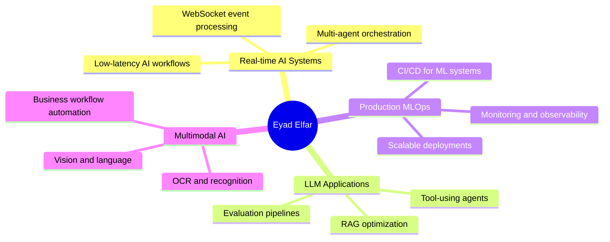

<picture>
  <source media="(prefers-color-scheme: dark)" srcset="https://capsule-render.vercel.app/api?type=waving&color=gradient&customColorList=6,11,20&height=190&section=header&text=Eyad%20Elfar&fontSize=72&fontAlignY=35&animation=twinkling&fontColor=ffffff" />
  <source media="(prefers-color-scheme: light)" srcset="https://capsule-render.vercel.app/api?type=waving&color=gradient&customColorList=1,14,30&height=190&section=header&text=Eyad%20Elfar&fontSize=72&fontAlignY=35&animation=twinkling&fontColor=0D1117" />
  
</picture>

# AI Engineer · LLM Specialist · Agentic Systems Builder

 

 

<picture>
  <source media="(prefers-color-scheme: dark)" srcset="https://img.shields.io/badge/Theme-Dark%20Mode%20Detected-0D1117?style=for-the-badge&logo=github&logoColor=white&labelColor=161B22" />
  <source media="(prefers-color-scheme: light)" srcset="https://img.shields.io/badge/Theme-Light%20Mode%20Detected-F6F8FA?style=for-the-badge&logo=github&logoColor=181717&labelColor=ffffff" />
  
</picture>

  

---

##  About Me

Hi, I’m **Eyad Elfar**, an **AI Engineer based in Dubai, UAE**. I build production-grade AI systems across **LLMs, RAG, agentic workflows, automation, multimodal AI, and MLOps**.

I care about AI that does more than demo well. My focus is building systems that are **fast, reliable, measurable, and useful inside real business workflows**.

### What I build

- **LLM applications** with retrieval, tools, memory, and workflow orchestration
- **RAG systems** for CRM intelligence, knowledge search, and decision support
- **Multi-agent systems** for sales, reporting, and business automation
- **Computer vision and NLP pipelines** with deployment-ready architecture
- **Data products** that connect analytics, automation, and business impact

 

---

##  Impact Snapshot

<table align="center">
<tr>
<td align="center" width="25%">
<h3>10+</h3>
<b>Production AI Systems</b>
</td>
<td align="center" width="25%">
<h3>68%</h3>
<b>Prep Time Reduced</b>
</td>
<td align="center" width="25%">
<h3>90%</h3>
<b>Reporting Automated</b>
</td>
<td align="center" width="25%">
<h3>Bronze</h3>
<b>Kaggle Notebook Medal</b>
</td>
</tr>
<tr>
<td align="center" width="25%">
<h3>15%</h3>
<b>Conversion Boost</b>
</td>
<td align="center" width="25%">
<h3>15K+</h3>
<b>Students Served</b>
</td>
<td align="center" width="25%">
<h3>&lt;750ms</h3>
<b>Event Processing</b>
</td>
<td align="center" width="25%">
<h3>50+</h3>
<b>Languages Supported</b>
</td>
</tr>
</table>

---

##  Professional Journey

<table>
<tr>
<td width="50%" valign="top">

###  AI Automation Engineer
**Baron & Cabot** · Dubai, UAE  
*May 2025 – Present*

Building real-time AI systems for sales intelligence, CRM automation, and agentic workflow orchestration.

**Highlights**

- Built a **multi-agent Sales Co-pilot** using RAG, CRM context, and workflow automation
- Reduced pre-call preparation time by **68%**
- Improved first-call conversion by **15%**
- Automated **90%** of manual reporting workflows
- Designed real-time event handling with **sub-750ms WebSocket processing**

**Core stack:** GCP Vertex AI, RAG, CrewAI-style orchestration, WebSockets, CRM intelligence

</td>
<td width="50%" valign="top">

###  Data Scientist
**MENRV.AI** · Remote, UAE  
*Apr 2024 – Apr 2025*

Developed AI systems across virtual try-on, content generation, forecasting, and multilingual experiences.

**Highlights**

- Achieved **90% virtual try-on fit accuracy** across supported scenarios
- Reduced reporting workflows from **8 hours to 5 minutes**
- Built multilingual TTS experiences supporting **50+ languages**
- Improved content generation speed by **80%**
- Delivered forecasting workflows using deep learning and statistical models

**Core stack:** vLLM, BiLSTM, Prophet, TTS, automation pipelines

</td>
</tr>
<tr>
<td width="50%" valign="top">

###  Data Scientist, Freelance
**Just to Learn** · Remote, Egypt  
*Nov 2024 – Apr 2025*

Built AI components for AR-based learning platforms and assessment intelligence.

**Highlights**

- Served **15,000+ students** through AI-powered learning tools
- Built handwriting recognition and LLM-based evaluation workflows
- Reached **92% educator-alignment accuracy**
- Reduced debugging time by **75%** through CI/CD improvements
- Supported deployment across **20 German schools**

**Core stack:** LLM evaluation, OCR, CI/CD, analytics, AR education workflows

</td>
<td width="50%" valign="top">

###  AI Instructor
**iSchool** · Hybrid, Egypt  
*Dec 2023 – Mar 2024*

Taught AI fundamentals, Python, and practical machine learning to young learners.

**Highlights**

- Mentored **70+ students** across **64 interactive sessions**
- Guided students through **36 AI-driven game projects**
- Taught Python, AI fundamentals, reinforcement learning, Arduino, and PictoBlox

**Core stack:** Python, ML fundamentals, RL basics, Arduino, PictoBlox

</td>
</tr>
</table>

---

##  Featured Projects

### From research ideas to deployable AI systems

<table>
<tr>
<td width="50%" valign="top">

###  Gamers’ Mental Health Classifier
**NLP · Explainable AI · Kaggle Notebook**

Built an NLP pipeline to classify mental-health-related risk signals in gaming community discussions.

**Impact**

- **94%** classification accuracy
- Earned a **Kaggle Bronze Notebook Medal**
- **5,000+** Reddit posts processed
- SHAP explanations for transparent model decisions

**Stack**

</td>
<td width="50%" valign="top">

###  Cigarette Butt Detection System
**Computer Vision · Real-time Detection · Environmental AI**

Developed a YOLOv8-based object detection system for identifying cigarette-butt litter in public-space imagery.

**Impact**

- **92%** detection accuracy
- Real-time detection with dashboard integration
- Up to **70%** reduction in manual monitoring effort
- Designed for public-space monitoring workflows

**Stack**

</td>
</tr>
<tr>
<td width="50%" valign="top">

###  English Character OCR Engine
**OCR · Deep Learning · Deployment-ready Recognition**

Created a custom OCR pipeline for English character recognition on scanned or low-quality documents.

**Impact**

- **96%** character recognition accuracy
- Robust preprocessing for noisy document quality
- Packaged for API-based deployment
- Designed for production-style testing and iteration

**Stack**

</td>
<td width="50%" valign="top">

###  One-Shot Attendance System
**Graduation Thesis · Face Recognition · Real-time Dashboarding**

Built a real-time attendance system that captures attendance from a single image using face detection and recognition.

**Impact**

- One-shot attendance capture without manual roll call
- Combined YOLO, RetinaFace, and MTCNN
- Integrated records with MySQL and MS SSIS
- Built live reporting dashboards with Power BI

**Stack**

</td>
</tr>
</table>

---

##  Technical Arsenal

### AI / ML Specializations

<b>Core engineering stack</b>

 

**Languages & APIs**

**AI / ML Frameworks**

**Cloud, Data & MLOps**

---

##  Education & Certifications

<table>
<tr>
<td width="50%" valign="top">

### BSc in Computer Science & Artificial Intelligence
**Helwan University** · Egypt  
*2020 – 2024*

**Grade:** Excellent with Honors

**Graduation project:** One-Shot Attendance System using advanced face detection and recognition.

</td>
<td width="50%" valign="top">

### Certifications

- McKinsey Forward Program — McKinsey & Company, 2024
- NLP Specialization — Coursera, 2024
- Secure Intelligence Training — Ericsson, 2023
- Data Science Diploma — Orange Digital Center, 2023
- Machine Learning Nanodegree — Udacity & EGFWD, 2023

</td>
</tr>
</table>

---

##  Currently Building & Exploring

```mermaid
mindmap
  root((Eyad Elfar))
    Real-time AI Systems
      Multi-agent orchestration
      WebSocket event processing
      Low-latency AI workflows
    LLM Applications
      RAG optimization
      Tool-using agents
      Evaluation pipelines
    Production MLOps
      CI/CD for ML systems
      Monitoring and observability
      Scalable deployments
    Multimodal AI
      Vision and language
      OCR and recognition
      Business workflow automation
```

---

<b> Theme-Aware GitHub Activity</b>

 

<picture>
  <source media="(prefers-color-scheme: dark)" srcset="https://github-readme-streak-stats-eight.vercel.app/?user=eyadelfar&theme=tokyonight&hide_border=true&date_format=M%20j%5B%2C%20Y%5D&ring=3ABEF9&fire=FF6B6B&currStreakLabel=3ABEF9" />
  <source media="(prefers-color-scheme: light)" srcset="https://github-readme-streak-stats-eight.vercel.app/?user=eyadelfar&theme=default&hide_border=true&date_format=M%20j%5B%2C%20Y%5D&ring=3ABEF9&fire=FF6B6B&currStreakLabel=0D1117" />
  
</picture>

  

<picture>
  <source media="(prefers-color-scheme: dark)" srcset="https://github-readme-activity-graph.vercel.app/graph?username=eyadelfar&theme=tokyo-night&hide_border=true&area=true&custom_title=Contribution%20Graph" />
  <source media="(prefers-color-scheme: light)" srcset="https://github-readme-activity-graph.vercel.app/graph?username=eyadelfar&theme=github-compact&hide_border=true&area=true&custom_title=Contribution%20Graph" />
  
</picture>

  

<picture>
  <source media="(prefers-color-scheme: dark)" srcset="https://github-profile-trophy-tawny.vercel.app/?username=eyadelfar&theme=tokyonight&no-frame=true&no-bg=false&margin-w=4&column=7" />
  <source media="(prefers-color-scheme: light)" srcset="https://github-profile-trophy-tawny.vercel.app/?username=eyadelfar&theme=flat&no-frame=true&no-bg=true&margin-w=4&column=7" />
  
</picture>

---

##  Let’s Collaborate

I’m open to collaboration around **LLM systems, RAG, AI automation, data products, computer vision, and production ML workflows**.

 

  

### “The best way to predict the future is to create it.”

<picture>
  <source media="(prefers-color-scheme: dark)" srcset="https://capsule-render.vercel.app/api?type=waving&color=gradient&customColorList=6,11,20&height=100&section=footer" />
  <source media="(prefers-color-scheme: light)" srcset="https://capsule-render.vercel.app/api?type=waving&color=gradient&customColorList=1,14,30&height=100&section=footer" />
  
</picture>

